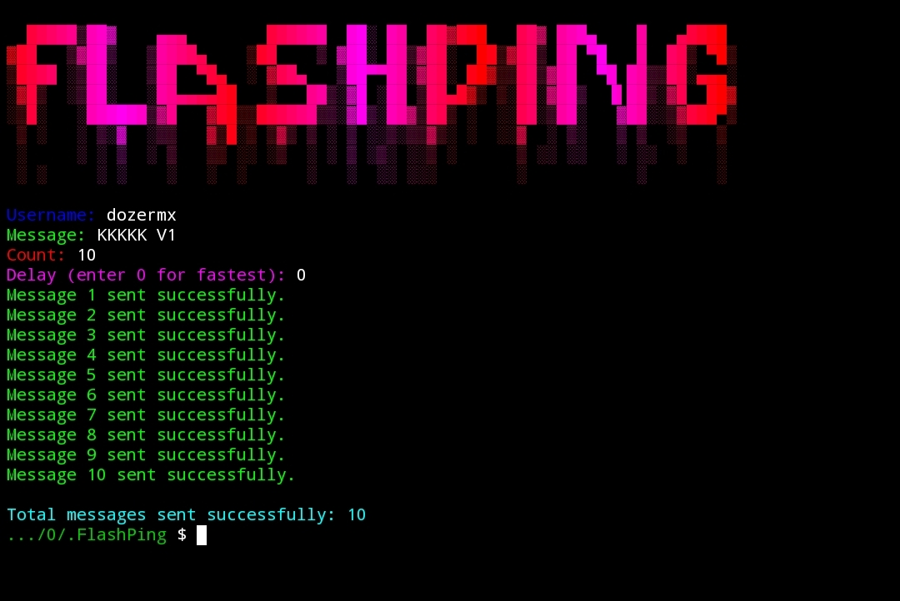

# FlashPing 🚀 - NGL Spammer

<div align="center">
    
    <p>Herramienta automatizada para envío masivo de mensajes en NGL.link</p>
</div>

## ⚠️ Derechos de Autor

Creado con el máximo cuidado por DozerMx ❤️  
© 2024 DozerMx. Todos los derechos reservados.

## 🤔 ¿Qué es FlashPing?

FlashPing es una herramienta automatizada para enviar mensajes masivos en NGL.link. Permite el envío rápido y eficiente de mensajes, eludiendo las restricciones de la plataforma.

## 📋 Requisitos

- Python 3.x
- Paquetes en `requirements.txt`
- Conexión a internet

## 🚀 Instalación

1. **Clona el repositorio:**

   ```bash
   git clone https://github.com/DozerMx/FlashPing.git

2. Instala las dependencias:

```bash
pip install -r requirements.txt
```


🎮 Uso

1. Asegúrate de tener el archivo user-agents.txt en la misma carpeta del proyecto.


2. Ejecuta el script:

```bash
python FlashPing.py


3. Ingresa los datos cuando se te soliciten:

Username: El nombre de usuario de NGL (sin el @).

Message: El texto que quieres enviar.

Count: Número de mensajes.

Delay: Tiempo entre mensajes (0 para sin delay).


⚠️ Advertencias

No abuses de la herramienta.

Si experimentas errores, aumenta el delay.

Usa VPN si te bloquean.


📞 Contacto

GitHub: DozerMx

¿Encontraste un bug? ¡Avísame!


📜 Licencia

Código abierto. Da crédito donde corresponde.


---

<div align="center">
    <p>Hecho con ❤️ por DozerMx</p>
    <p>© 2024 - Úsalo con responsabilidad.</p>
</div>
